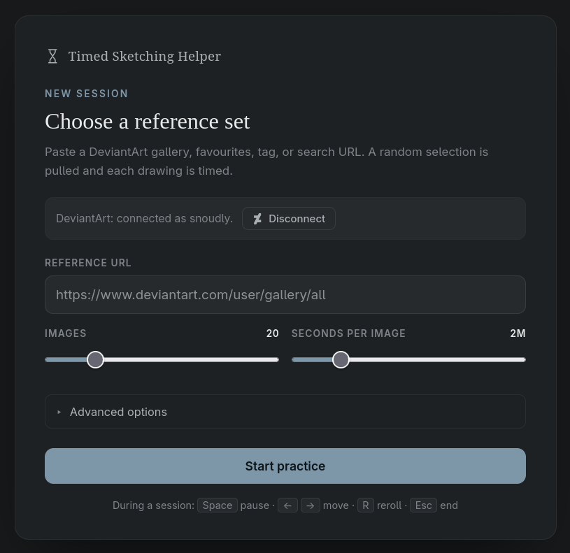

# Timed Sketching Helper

A small local web app for timed drawing practice. Point it at a DeviantArt
gallery, favourites collection, tag, or search; it fetches the images and then
shows a random subset one at a time for a fixed number of seconds each
(default 90s) — the same drill as a life-drawing class, but with your own
reference pool.

Everything runs on your machine. The only network calls are to the DeviantArt
API; saved reference URLs never leave the browser (see [Privacy](#privacy)).

| Start screen | Timed session |
| --- | --- |
|  |  |

## Setup

Requires [uv](https://docs.astral.sh/uv/).

```bash
uv sync
cp .env.example .env
```

Register a DeviantArt application at
<https://www.deviantart.com/developers/>, then edit `.env`:

- Put the app's **client id** and **secret** into `DEVIANTART_CLIENT_ID` /
  `DEVIANTART_CLIENT_SECRET`.
- Add the value of `DEVIANTART_REDIRECT_URI`
  (`http://127.0.0.1:8765/auth/deviantart/callback` by default) verbatim to the
  app's **OAuth2 Redirect URI Whitelist** — the "Connect DeviantArt" login
  needs this to match exactly.

`.env.example` documents the remaining optional settings (data directory, list
cache lifetime, fetch cap).

### Sensitive / mature content

Images DeviantArt marks mature or sensitive come back *blurred* unless you're
signed in with an account allowed to see them. Blurred images are useless as
references, so the app drops them — they never appear in a list or session. To
include sensitive images, click **Connect DeviantArt** on the start screen and
log in with an account that has mature content enabled in its settings. Lists
you already fetched keep their old contents until they expire (24h) or you tick
**Re-download images** when starting the next session.

## Run

```bash
uv run timed-sketching-helper
```

Then open <http://127.0.0.1:8765>.

Flags: `--host`, `--port`, `--log-level`, `--debug` (verbose logging, including
every DeviantArt API request). See `--help` for details.

Paste a DeviantArt URL such as:

- `https://www.deviantart.com/<user>/gallery/all`
- `https://www.deviantart.com/<user>/gallery/<id>/<name>`
- `https://www.deviantart.com/<user>/favourites/all`
- `https://www.deviantart.com/<user>/favourites/<id>/<name>`
- `https://www.deviantart.com/tag/<tag>`
- `https://www.deviantart.com/search?q=<query>`
- `https://www.deviantart.com/morelikethis/<user>/<deviation-id>`

A group's gallery URL works too — its folders are aggregated automatically.

Set the image count and seconds-per-image, then **Start practice**.

During a session: **Pause** (space), **Prev** (←), **Skip** (→), **Reroll**
(`r`) to swap the current image for another random one from the list. Drag to
pan and scroll to zoom; the toolbar can be docked to any edge. **End** returns
to the start screen.

## How it works

- The backend fetches the list and hands the browser a randomized selection.
  The countdown timer and every session control run client-side; the server
  keeps no session state.
- Fetched lists and downloaded image bytes are cached under `./data/`
  (`app.db` + `cache/`, both safe to delete). A list older than
  `LIST_TTL_HOURS` (24 by default) is re-fetched on the next session.
- A list fetch stops at `MAX_IMAGES` deviations (300 by default, hard ceiling
  1000) — a session only ever shows a handful.
- Images download lazily: each is fetched the first time it's shown, and the
  session's images are pre-downloaded in the background. If a signed image link
  has expired by the time you view it, the list is re-fetched and the image
  retried.
- Sources sit behind a small provider interface (`sources/base.py`), so other
  sites can be added without touching the rest of the app.

## Privacy

Saved and recent reference URLs live only in the browser's `localStorage`,
never on the server. The backend stores the image cache and DeviantArt OAuth
tokens under `./data/`, and nothing else.

The app is unauthenticated and binds to loopback by default. It ships with a
DNS-rebinding guard and a cross-site write guard; binding to a non-loopback
address disables the host check and prints a warning, since a public bind has
no auth in front of it.

## Development

```bash
uv run pytest                             # run the test suite
uv run uvicorn --factory timed_sketching_helper.main:create_app --reload   # dev server with reload
```

`respx` mocks the DeviantArt API, so the tests need no network or credentials.
`static/` is three hand-written files (`index.html`, `styles.css`, `app.js`) —
there is no frontend build step. `CLAUDE.md` has a fuller architecture tour.

## License

[MIT](LICENSE)
