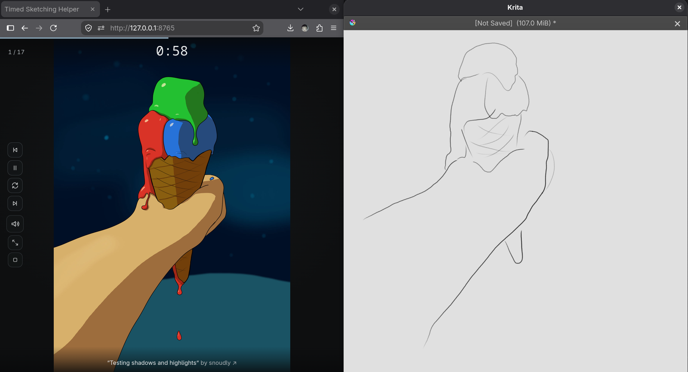

# Timed Sketching Helper

A small local web app for timed drawing practice.

Point it at a DeviantArt gallery, favourites collection, tag, or search; it
shows a random subset one at a time for a fixed number of seconds each — the
same drill as a life-drawing class, but with your own reference pool.

Everything runs on your machine, and only talks with DeviantArt.




## Setup

Requires [uv](https://docs.astral.sh/uv/).

```bash
uv sync
cp .env.example .env
```

Register a DeviantArt application at
<https://www.deviantart.com/developers/>, then edit `.env`:

- Put the app's **client id** and **secret** into `DEVIANTART_CLIENT_ID` /
  `DEVIANTART_CLIENT_SECRET`.
- Add the value of `DEVIANTART_REDIRECT_URI`
  (`http://127.0.0.1:8765/auth/deviantart/callback` by default) verbatim to the
  app's **OAuth2 Redirect URI Whitelist**.

`.env.example` documents the remaining optional settings.

## Run

```bash
uv run timed-sketching-helper
```

Then open <http://127.0.0.1:8765>, paste a DeviantArt URL (a user's gallery,
favourites, a tag, a search, or a group gallery), and hit **Start practice**.

Images DeviantArt marks mature/sensitive are dropped, unless you **Connect
DeviantArt** on the start screen with an account that has mature/sensitive
content enabled.

## Privacy

Saved and recent reference URLs live in the browser's `localStorage`, not on
the server. The backend stores the image cache and DeviantArt OAuth tokens
under `./data/` (safe to delete), and nothing else.

The app is unauthenticated and binds to loopback by default; binding to a
non-loopback address prints a warning, since a public bind has no auth in
front of it.

## Development

```bash
uv run pytest    # run the test suite
```

`static/` is three hand-written files (`index.html`, `styles.css`, `app.js`)
— there's no frontend build step. See `CLAUDE.md` for a fuller architecture
tour.

## License

[MIT](LICENSE) - most of the code is written by AI (Claude Sonnet 5), so I
can't take much credit. Use as you want!
